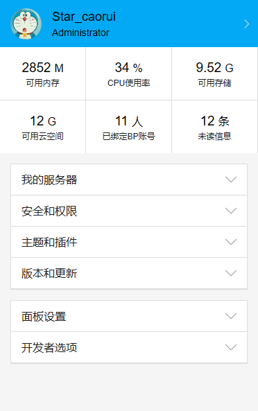

# Bedrock-Panel
## 介绍

> 本项目使用 **Mozilla Public License 2.0** 协议，未经授权，禁止用于商业用途。
>
> *Bedrock-Panel开发组开发此项目，免费授权给Bedrock服主使用，禁止以一切形式的恶意倒卖！*

#### **Bedrock-Panel** 是一款基于 PHP 开发的网页管理面板，为了简化开服操作而进行的开服。

- 多用户 满足您多用户管理的需求
- 多实例 满足您多服务器管理的需求
- 扩展性 提供 API 接口，您可以随意扩展 ( WEB、PC、APP、QQbot )
- 隔离性 每个服务器之间我们都是隔离的，您无需担心数据冲突等问题

## 地址

#### Bedrock-Panel 官方

- 官网: https://bedrock-panel.com
- 使用文档: https://bedrock-panel.com/docs

#### Github

- Git: https://github.com/bedrock-panel/Bedrock-Panel/
- Download: https://github.com/bedrock-panel/Bedrock-Panel/releases

#### 码云(Gitee)

- Git: 暂未提交
- Download: 暂未提交

## 快速部署

#### 部署说明

- 依赖环境：
> 1
> 2
- 第二步
- 第三步
- 第四步
- 第五步

### 命令行帮助

### 启动服务

## 部分界面展示

### 主界面

### 登录页

### 安装页

### 设置页

### 用户管理页

### 服务器管理页

## 部分功能使用演示

### 开关服务器

### 开关白名单

## 关于

- Team: Bedrock-Panel
- URL: https://bedrock-panel.com

## 反馈群

交流群:635066418
